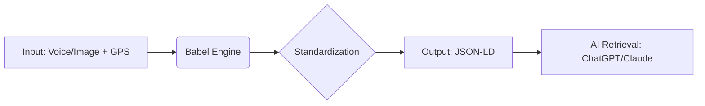

# Project Babel: The Physical World to AI Protocol
# 巴别塔计划：物理世界与 AI 的通用接口协议

> **Structure the Unstructured.**
> 将物理世界的碎片信息（语音、图片、位置），转化为 AI 能够读取的标准化 LBS 数据。

---

## 1. Vision (愿景)
Current LLMs live in a digital void. They don't know the coffee shop downstairs is closed, or that your neighbor is selling a keyboard right now.
目前的 AI 大模型活在数字真空中。它们不知道楼下的咖啡馆刚刚关门，也不知道你附近有人正在出售闲置物品。

**Project Babel** is a middleware protocol. It leverages **LBS (Location-Based Services)** and **Semantic Understanding** to convert unstructured real-world signals into **Standardized JSON Data**, making the physical world searchable for AI Agents.

**Project Babel** 是一个中间件协议。它利用 **LBS (地理位置)** 和 **语义理解**，将现实世界的非结构化信号转化为**标准化的 JSON 数据**，让物理世界对于 AI Agent 来说变得“可检索”。

## 2. Core Logic (核心逻辑)

## 3. How to Use (如何使用)

This repository provides the core System Prompt and JSON Schemas. 本仓库提供了核心的系统提示词和数据标准，你可以直接部署到 Coze/Dify/GPTs 中。

Core Prompt: located in core_prompt.md.

Deploy this to your LLM Agent to enable the "Babel" capability.

Schema: located in standard_schema.json.

Use this to validate the data structure.

## 4. Use Cases (应用场景)

Hyper-local Commerce (本地交易): * User: "Selling a keyboard, pick up at Sanlitun."

Babel: Generates a Structured Product API.

Real-time Status (实时状态): * User: "Costco queue is 30 mins long."

Babel: Generates an LBS Status API.

Resource Sharing (资源共享): * User: "I have a free parking spot here."

Babel: Generates a Resource Allocation API.

## 5. License
MIT License. Designed by an Interaction Designer for the AI Era.
